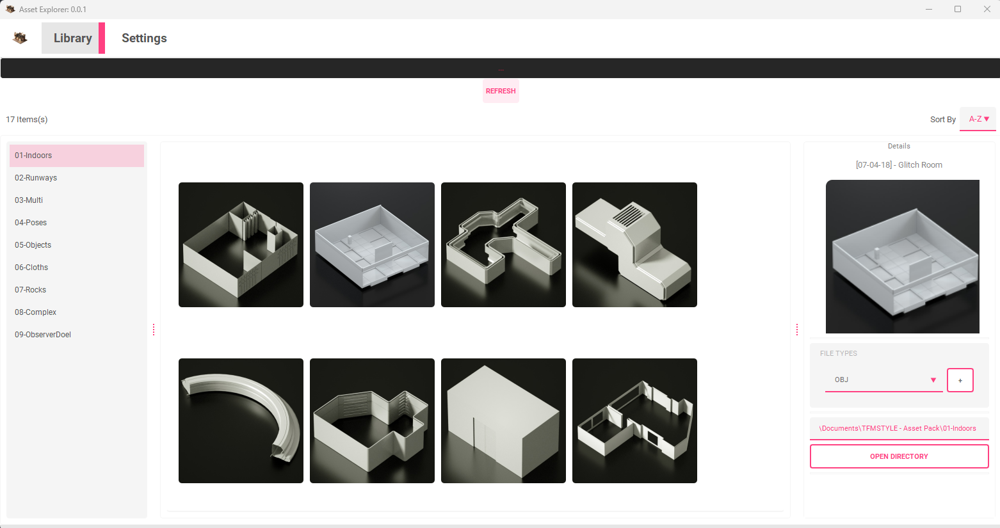

# Gingerbread 0.0.1 (WIP)

A simple PyQt based Asset Browser using a modern GUI and has the ability to run in multiple DCCs that support Qt Framework (Python 3 Only).
This project was re-purposed from an other private project and is still a Work in Progress. 
Currently, it supports Standalone Python and Houdini, More to come soon. (Python 3 Environments only)

## Demo

## Abilities

Responsive GUI with multiple custom widgets implemented.
The GUI supports profiles to be loaded with different paths depending on the DCC used.
Loads images with the corresponding obj/stl/fbx (More to expand and customize planned)
Add the item into the Context window of DCC using the + button.
Ability to open an explorer window to the directory of the item selected.

## License

[MIT](https://choosealicense.com/licenses/mit/)

